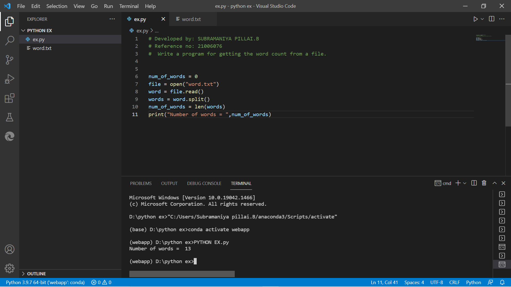

# Word-count
## AIM:
To write a python program for getting the word count from a text.
## EQUIPEMENT'S REQUIRED: 
PC
Anaconda - Python 3.7
## ALGORITHM: 
### Step 1: 
OPEN VISUAL STUDIO CODE

### Step 2: 
Create file with .py extension
### Step 3: 
TYPE THE PROGRAM
### Step 4:  
WRITE THE TEXT 
### Step 5: 
Run terminal for output of the given program
### Step 6: 
TAKE SCREEN SHOT OF THE OUTPUT
## PROGRAM:
### Developed by: SUBRAMANIYA PILLAI.B 
### Reference no: 21006076
### Write a program for getting the word count from a file
```
num_of_words = 0
file = open('word.txt')
word = file.read()
words = word.split()
num_of_words = len(words)
print("Number of words = ",num_of_words)
```
### OUTPUT:



## RESULT:
Thus the program is written to find the word count from a text.
